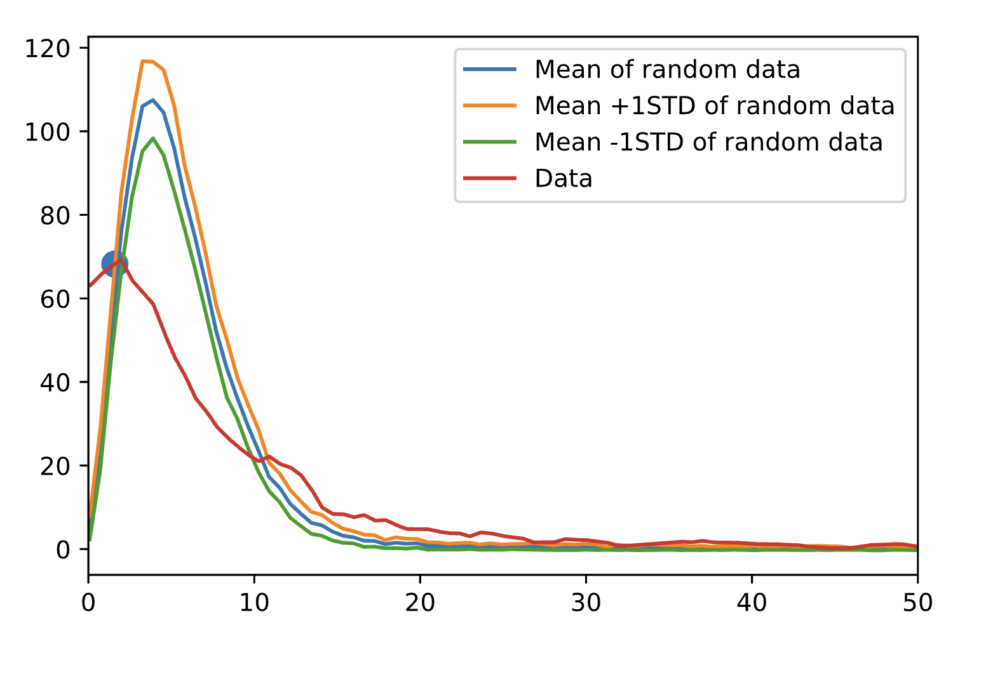

# secondary-crater-removal

[`scia.py`](scia.py) contains a pure Python implementation of [`SCIA.m`](scia.m), Anthony's original MATLAB secondary crater removal script.

## How to run

Python dependencies are managed using pipenv. Install pipenv and install dependencies with `pipenv install`. Then run a shell with `pipenv shell`. Then execute the script: `python scia.py`

## Comparison

The Python script has a very similar output to the MATLAB script.

Python outputs:



```
number of secondary craters:  134
```

MATLAB graph:


```
number of secondary craters:  140
```

## ArcGIS Implementation

### Current flow (using MATLAB)

- Load SHP file with a lot of craters
- Select a small area of craters and export as another SHP file
- Load THEMIS background image
- Run the Create Thiessen Polygons tool in the Analysis toolbox
  - Input features are the detection layer
  - Output fields = ALL
- Polygons now created with attributes (including new diameter_k)
- Right click Layers -> Properties -> Coordinate System -> Choose Mars2000_Equidistant_Cylindrical_clon0 (Anthony will send this)
- In table view -> Add Field
  - Name: area
  - Type: float
- Right click on "area" field and run "Calculate Geometry"
  - Use coordinate system of the data frame
  - Units = square kilometers

This table is now the input to the MATLAB script. Export Table to txt file.

To simulate a random crater population we also need to know the total area of our region of interest.

- Draw a rectangle around the outer limits of the Thiessen polygons on a new layer
- Add a new column to this layer's table called area and calculate the area using the method above

Export this to MATLAB.

Once you have run the simulation and found the threshold size, come back to ArcGIS.

- Go to the Thiessen table, run a select query - "Select by Attributes"
  - query is `"area" <= THRESHOLD_VALUE`
  - click apply
- Right click thiessen layer -> Export data - choose "Export selected" and save as a new shapefile called "thiessen_secondaries". Import the layer into the same map
- Invert selected
- Right click thiessen layer -> Export data - choose "Export selected" and save as a new shapefile called "thiessen_primaries". Import the layer into the same map

Now we want to select all of our Primary craters

- Go to Selection menu -> Select by location
  - Target layer = cda detections
  - Source layer = primary thiessen layer that you just exported
- Now primary craters are selected
- Right click crater layer and go to Data -> export -> choose to export selected and import the new layer back into the same map

Now we want to remove the secondary thiessen polygons from the counting area

- Choose the "Erase" tool from the analysis toolbox
  - Input feature = counting area
  - Erase feature = thiessen_secondaries

### Ideal plugin

User clicks on a tool in a toolbar which opens a tool GUI window.
GUI window has following form inputs:

- crater detection layer
- counting area layer
- output layers:
  - primary crater detections
  - primary counting area
  - secondary crater detections
  - secondary crater area
